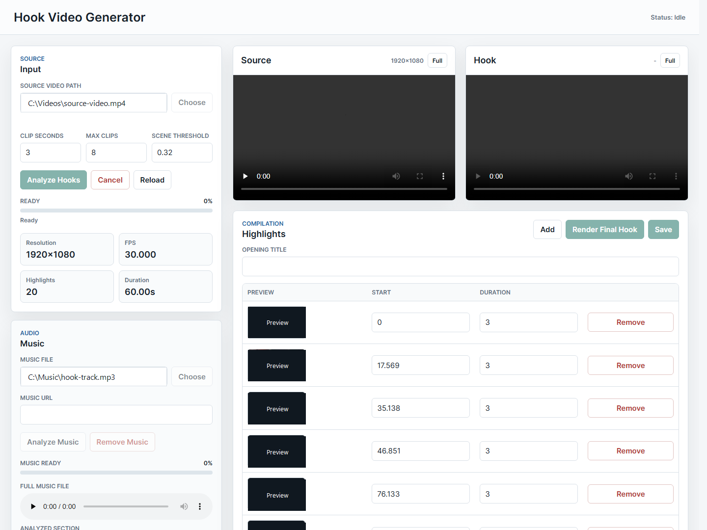

# Hook Video Generator

Create short hook videos from one source video.

Hook Video Generator finds strong moments in a source video, lets you review and edit the highlight list, optionally cuts clips to music beats, and renders a final hook video. It can keep the source video original, or export common social formats with auto reframe.



## User Guide

A full PDF guide with screenshots is included:

[Open the user guide PDF](docs/HookVideoGenerator_User_Guide.pdf)

## Features

- Choose one source video from your computer.
- Analyze the video to find hook-worthy highlight moments.
- Review highlights with thumbnail previews.
- Preview individual highlights before rendering.
- Preview the full hook with effects and music before final render using a faster lower-resolution preview file.
- Edit each highlight start time and duration.
- Add or remove highlights manually.
- Add a local music file or direct media file URL.
- Analyze music to find a strong section automatically.
- Listen to the full music file and the analyzed music section.
- Automatically detect beats in the music.
- Build a Music Director plan with tempo, energy sections, cut points, and effect hits.
- Auto-select beat style based on the music rhythm.
- Auto-recommend the visual effect from video motion/dialogue signals and music beat analysis.
- Cut highlights to music beats.
- Make effects react to the analyzed music plan, including build/drop sections and stronger beat hits.
- Control background music volume and original source audio volume.
- Choose visual effects: clean cuts, auto director, slow motion, kinetic whip, slow-fast ramp, beat punch, flash cuts, or impact shake.
- Add an HDR-style color boost to SDR video with natural or vivid modes.
- Export in source original, 9:16, 1:1, 4:5, or 16:9.
- Auto reframe when exporting to a different aspect ratio.
- Choose CPU, GPU, or automatic render mode.
- Pick the output path with a file chooser.
- Cancel long analyze, music analyze, or render jobs.
- See live progress while jobs run.
- Clear app-created workspace files safely after rendering.

## Start The App

Install dependencies:

```bash
npm install
```

Start the UI:

```bash
npm run ui
```

Open:

```text
http://127.0.0.1:3210
```

If port `3210` is already in use, the app will show the next available URL in the terminal.

## Basic Workflow

1. Click `Choose` beside `Source video path`.
2. Select your source video.
3. Adjust `Clip seconds`, `Max clips`, and `Scene threshold` if needed.
4. Click `Analyze Hooks`.
5. Review the generated highlight thumbnails.
6. Edit `Start` or `Duration`, or remove weak clips.
7. Add music if you want background music.
8. Click `Analyze Music` to find a strong music section and auto-pick beat style.
9. Enable `Cut highlights to music beats` if you want rhythm-based cuts.
10. Choose the final aspect ratio and effects.
11. Click `Preview Hook` to check the full edited hook with effects and music.
12. Choose the output path.
13. Click `Render Final Hook`.

## Music And Beat Sync

- `Analyze Music` finds a strong music section for the final hook duration.
- After analysis, the Music Director reads the song as sections such as intro, verse, build, drop, and outro.
- The Music Director creates cut points and effect hits from beat strength, section energy, and tempo.
- `Beat style` is selected automatically after music analysis.
- `Effects` is also recommended automatically after hook analysis, then refined after music analysis.
- `Loose` creates slower, longer rhythm cuts.
- `Tight` is the balanced default for most hooks.
- `Fast` creates quicker cuts for dense, energetic beats.
- `Auto director` effects use the Music Director plan to choose between slow motion, beat punch, kinetic whip, and impact moments.
- `Slow-fast ramp` follows songs that begin slower and build into faster sections.

## Export Options

- `Source original`: keeps the original source resolution and aspect ratio.
- `9:16 vertical`: good for TikTok, Shorts, and Reels.
- `1:1 square`: good for square social posts.
- `4:5 portrait`: good for feed-style vertical posts.
- `16:9 landscape`: good for YouTube-style landscape videos.
- `Auto reframe`: reframes video when the final aspect ratio changes.
- `Color boost`: adds an HDR-style look to normal SDR video. This is a visual grade, not true HDR metadata.

## Render Options

- `Auto GPU`: uses hardware acceleration when available.
- `Force GPU`: requests GPU rendering.
- `CPU only`: renders without GPU acceleration.
- `GL`: choose the graphics backend. Start with `angle`; try `swiftshader` if GPU rendering fails.
- `Concurrency`: controls how many render workers run at once.
- `Timeout min`: increase this for very large or slow videos.

## Output

The rendered hook is saved to the selected output path. The default is:

```text
hook.mp4
```

## Requirements

- Node.js
- npm
- A Chromium-based rendering environment
